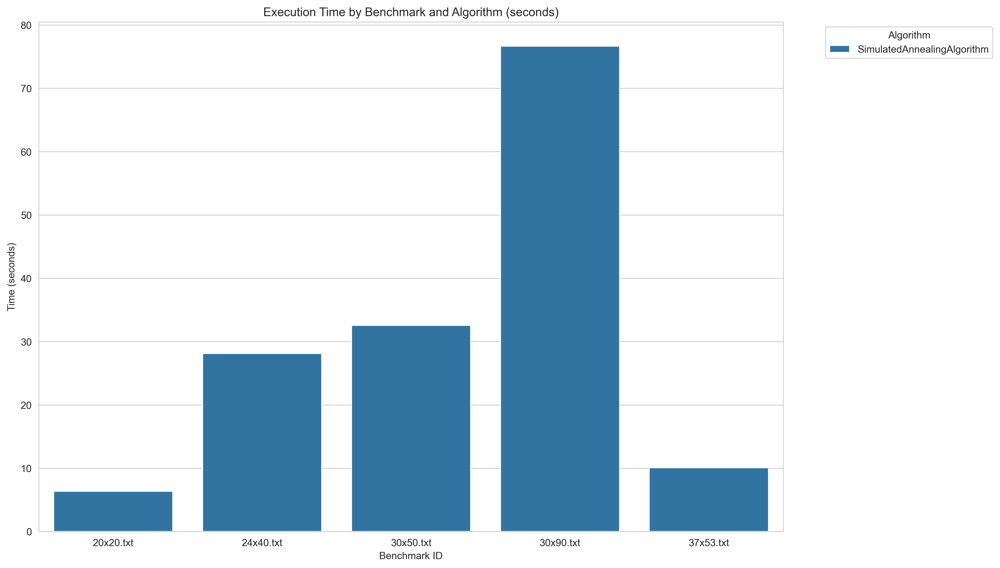
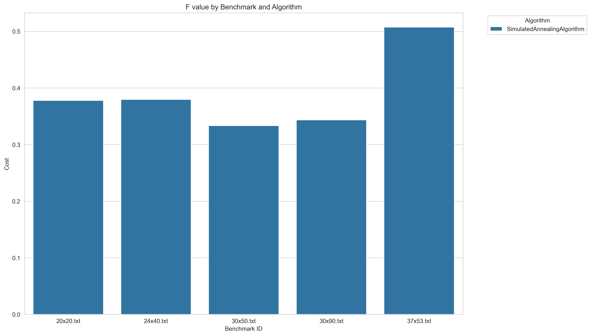

# IO-Lab5-CellFP

Simulated Annealing Algorithm

# Для работы
Склонируйте репозиторий, создайте виртуальное окружение 
и используйте следующие команды находясь в нем:

Подтяните необходимые зависимости из файла
```
pip install -r requirements.txt
```
Для запуска бенчмарков и получения result.csv
```
python -m src.benchmarks
```
Для построения графиков
```
python -m main
```

# **Отчет**

Мы реализовали метод имитации отжига для решения Cell Formation Problem.

**Результаты работы сохранены в папку results с расширением .sol**

## Гиперпараметры: 

- **num_clusters** = 2, 
- **t0** = 0.85, 
- **tf** = 0.1, 
- **alpha** = 0.9, 
- **l** = 100, 
- **d** = 10

- **num_clusters** - начальное количество кластеров,
- **t0** - начальная температура,
- **tf** - конечная температура, 
- **alpha** - коэффициент охлаждения, 
- **l** - количество итераций на каждом уровне температуры,
- **d** - частота применения exchange_move

# **Таблица:**

Хранится в папке src под названием **results.csv**

| benchmark_id | alg                          | benchmark    | best_total_cost | avg_time_sec | best_parts                                                                                                 | best_machines                                                                                     |
|--------------|------------------------------|--------------|-----------------|--------------|-----------------------------------------------------------------------------------------------------------|--------------------------------------------------------------------------------------------------|
| 20           | SimulatedAnnealingAlgorithm  | 20x20.txt    | 0.3777778       | 6.3522193    | 2 1 1 0 0 2 1 1 2 1 0 2 0 0 0 0 0 0 2 2                                                                  | 2 1 0 2 1 1 2 2 2 0 0 0 0 0 1 0 0 1 1 1                                                         |
| 24           | SimulatedAnnealingAlgorithm  | 24x40.txt    | 0.3796296       | 28.0991674   | 0 1 2 3 3 2 0 1 4 2 1 2 4 4 2 5 0 3 0 0 1 4 2 3 1 3 3 1 0 3 0 1 4 5 2 5 5 3 5 4                          | 0 4 2 1 2 3 1 3 4 3 2 3 2 1 3 5 0 3 4 1 4 0 1 1                                                 |
| 30           | SimulatedAnnealingAlgorithm  | 30x50.txt    | 0.3333333       | 32.5569402   | 0 5 5 0 2 2 2 1 1 3 1 5 4 3 4 0 3 3 5 3 4 4 1 1 1 2 2 2 0 2 3 3 0 4 3 0 5 5 3 1 4 0 4 1 0 4 0 5 4 2      | 4 5 0 4 5 5 2 0 4 5 1 1 1 3 3 3 2 2 2 2 3 4 4 4 0 3 4 3 1 3                                     |
| 30           | SimulatedAnnealingAlgorithm  | 30x90.txt    | 0.3435583       | 76.6451461   | 0 1 1 8 1 1 1 2 3 4 4 4 0 5 2 0 6 7 1 7 2 2 8 5 0 9 9 4 0 7 0 5 7 9 6 4 5 8 9 2 4 1 0 3 1 1 5 6 4 9 2 8 5 0 6 8 9 5 3 9 4 9 6 8 3 5 3 2 8 3 3 0 2 7 9 2 6 6 6 8 7 8 7 4 7 7 3 3 3 6 | 10 10 3 8 10 10 10 10 10 10 2 10 10 3 10 10 2 10 2 6 2 7 10 2 4 1 4 0 5 10                     |
| 37           | SimulatedAnnealingAlgorithm  | 37x53.txt    | 0.5073021       | 10.0791128   | 0 0 1 0 0 1 0 0 1 0 0 0 0 1 0 1 0 1 0 0 0 0 0 0 0 1 1 1 1 1 1 1 1 1 1 1 1 1 1 1 0 0 0 0 0 1 0 0 1 1 1 1 1 | 1 0 1 1 0 1 1 0 1 1 1 1 0 1 0 1 1 0 0 0 1 1 0 1 1 1 1 1 1 1 0 1 0 0 0 0 0                       |

# **Время работы:**



В целом, ожидаемое время работы - алгоритм не быстрый. Так как происходит перебор параметров и решения определенное
количество итераций. И все это повторяется для каждого количества кластеров до тех пор, 
пока разделение по большему количеству ячеек не дает улучшений.
Также видно, чем больше разница между количеством деталей и количеством
машин, тем больше времени требует алгоритм.

# **Итоговые результаты:**



Как видим, колеблется около 0.5. Это значение для функции: 
f = (n1 - n1_out) / (n1 + n0_in)
